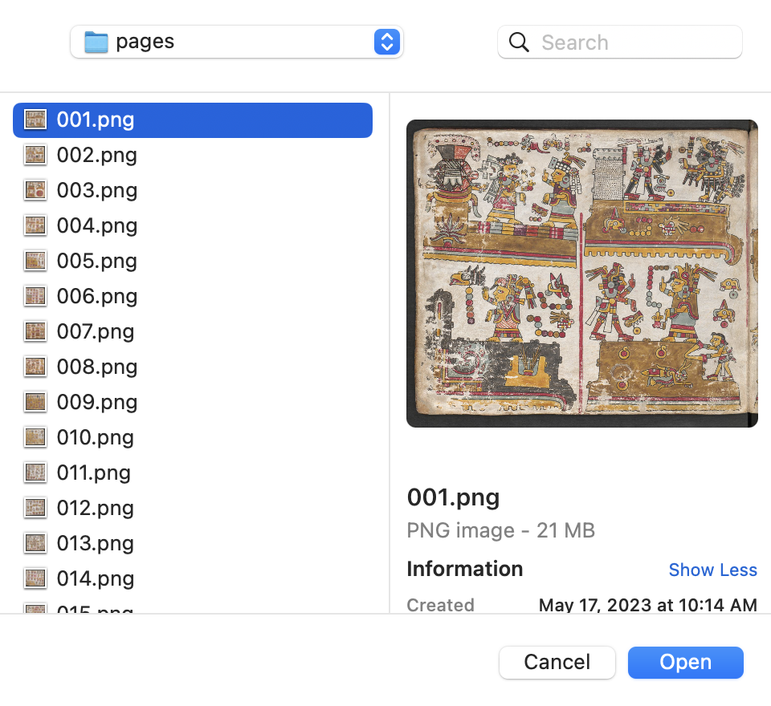

# mixteclabeling
Repository with directions, label, scripts, and information for mixtec labeling metadata.

## Segmenting Workflow:

# Load codex page into Segment-Anything Demo:

# Add sufficient number of points (mask prompts) to segment figure

# Cut-out segmented figure 

# Drag figure to "cutouts" folder to export

# Rename newly exported png figure according to this scheme:

* "pageNumber-qualityIndicator-figureOnPageCount.png"

	* Page numbers are relative to each codex and can be found in the file name for the given page. 

	* Qualities range from a to c, and examples can be found below:
		* A. 
		* B. 
		* C. 

	* The last two-digit number in the file name corresponds the order in which the figures are segmented. 

* For example:

	* "001-a-01.png" -> This stands for the first page (001), "a" level quality, and the first figure segmented on the given page (01).

* Accordingly, the second figure encountered on the first page will be (assuming "a" level quality): 
	* "001-a-02.png"

* If the figure extracted is an animal, or non-human entity, it will be named similarly, except we use a character from the alphabet instead of a two-digit number (assuming "a" level quality:

	* "001-a-a.png"

* Accordingly, the second animal, or non-human entity, encountered on the first page will be named (assuming "a" level quality):

	* "001-a-b.png"

